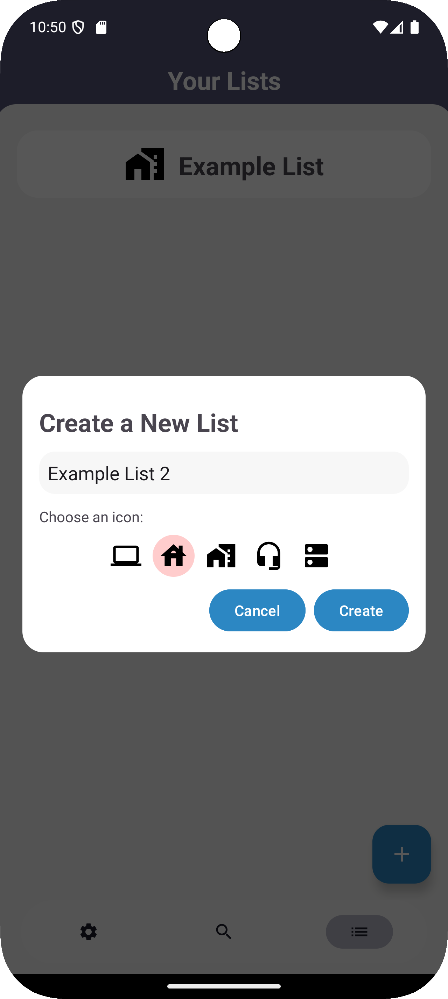

# PCPartPicker Android App

A custom Android application inspired by [PCPartPicker](https://pcpartpicker.com/) that enhances the PC building experience with advanced component management, custom pricing integration, and offline support.

## 🎯 Overview

PCPartPicker extends the typical PC building experience by allowing users to:
- Create and manage **custom component lists** with multiple build configurations
- View **detailed component specifications** with ratings and vendor availability  
- Integrate **custom pricing and bundles** for manual connections to additional vendors
- Browse parts through a **powerful search API** or by **category** with pagination and region support

---

## ✨ Features

- 🔍 **Advanced Search & Filter**: Search components by name or browse by product type with intelligent filtering
- 📄 **Smooth Pagination**: Infinite scroll with efficient page-by-page loading for large datasets
- 📱 **Custom Build Lists**: Create, save, view, and manage multiple PC builds locally
- 💾 **Robust Offline Support**: Powered by **Room Database** for reliable local data persistence
- 🌍 **Multi-Region Support**: Dynamically loads pricing and availability using stored region preferences
- ⚡ **Real-time Updates**: Built with `LiveData` + `ViewModel` architecture for responsive UI updates
- 🛠 **Smart Error Handling**: In-app error reporting with automatic retry mechanisms

---
## 🖼️ Examples  
As described above, the app allows for searching through input or by category. 
<p align="center">
   
   &nbsp;&nbsp;&nbsp;
   
</p>

As described above, the app allows for the creation of custom lists, bundles, and easy management of components within them! 
<p align="center">
   
   &nbsp;&nbsp;&nbsp;
   
   &nbsp;&nbsp;&nbsp;
   
</p>

Shown below are early examples of swapping themes and switching to dark mode.  
<p align="center">
   
   &nbsp;&nbsp;&nbsp;
   
</p>

---

## 🏗️ Tech Stack

| Category | Technology |
|----------|------------|
| **Language** | Kotlin |
| **Architecture** | MVVM (Model-View-ViewModel) |
| **Networking** | Retrofit2 + Gson |
| **Local Database** | Room (Android Jetpack) |
| **UI State Management** | LiveData, ViewModel |
| **Async Operations** | Kotlin Coroutines |
| **Dependency Injection** | Manual ViewModelFactory* |
| **Configuration** | Custom API URL via `BuildConfig` |

---

## 🚀 Setup & Installation

### Prerequisites
- Android Studio Arctic Fox or later
- Android SDK API level 21+
- Kotlin 1.7+

### Backend Setup
1. Follow the setup instructions at [PCPP_API](https://github.com/SlothCodeSloth/PCPP_API)
2. Start your local server (use Ngrok for remote debugging if needed)
3. Note your API base URL for configuration

### App Installation
1. **Clone the repository**
   ```bash
   git clone https://github.com/SlothCodeSloth/PCPP_AndroidApp.git
   cd PCPartPickerPlus
   ```

2. **Configure API endpoint**
   
   Option A: Update `BuildConfig` (recommended)
   ```kotlin
   // In app/build.gradle
   buildConfigField "String", "API_BASE_URL", "\"http://your-api-url:port/\""
   ```
   
   Option B: Direct configuration
   ```kotlin
   // In MyApplication.kt
   private val BASE_URL = "http://your-api-url:port/"
   ```

3. **Build and run**
   ```bash
   ./gradlew assembleDebug
   # Or use Android Studio's Run button (Android Emulator or Physical Android Device Required)
   ```

---

## 📱 Usage

1. **Browse Components**: Navigate through different component categories or use the search function
2. **View Details**: Tap any component to see detailed specifications, pricing, and vendor information
3. **Create Builds**: Add components to custom lists and manage multiple build configurations
4. **Create Bundles**: Added integration for bundles that may be offered externally
5. **Custom Data**: Allows for custom Pricing and URL's for adaptability with other retailers (manual)
6. **Offline Access**: Previously viewed components and saved builds work without internet connectivity

---

## 🔧 Configuration

### API Configuration
The app supports flexible API configuration through:
- Environment-specific build variants
- Runtime configuration updates
- Regional API endpoint switching

### Database
Room database automatically handles:
- Schema migrations
- Data persistence
- Query optimization

---

## 📋 To Do


- [ ] Enhanced Theme Support (Separated Dark/Light Themes)
- [ ] Correct issues with Bundles
- [ ] Improve UI for easier motions
- [ ] Add an intro sequence that plays on first startup

---

## 📄 License

This project is licensed under the MIT License - see the [LICENSE](LICENSE) file for details.

---

## 🙏 Acknowledgments

- Inspired by [PCPartPicker](https://pcpartpicker.com/)
- API: [PyPartPicker](https://github.com/thefakequake/pypartpicker)
- Backend: [PCPP_API](https://github.com/SlothCodeSloth/PCPP_API)
- Android Jetpack components
- Kotlin Coroutines community
